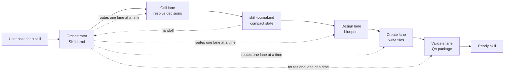

# Orchestrator Skill Designer

Built by [Andy Toizer](https://www.linkedin.com/in/andy-toizer/) — I'm the head of growth at [Freckle](https://freckle.io) and write [Agent Operator](https://agentoperator.substack.com/), a newsletter about what it actually looks like to build real systems with coding agents as a non-engineer, using live company data.

Built for people who use Claude Code and Codex to create reusable skills, agents, and workflow helpers.

**TLDR:** Orchestrator Skill Designer helps you turn a messy idea for a new skill into a clean orchestrator-led skill package: one small router, focused specialist lanes, reusable frameworks, deterministic tools where needed, and a compact journal so the agent does not have to keep rereading the whole conversation.

Most skills start simple and then grow into one long instruction file. This skill helps you avoid that. It gives the model a repeatable way to ask the right questions, design the architecture, create the files, and validate that the skill can actually be used later.

## What It Does

- **Grills the idea first** — starts with a focused discovery lane so unclear requirements get resolved before files are created
- **Designs the skill architecture** — decides what belongs in the orchestrator, specialist files, references, scripts, assets, and durable state
- **Creates the skill package** — scaffolds or updates a portable skill folder with the right file layout
- **Keeps context small** — uses a `skill-journal.md` handoff so each specialist can continue from compact state instead of reading everything
- **Validates the result** — checks frontmatter, links, lane contracts, journal behavior, and packaging hygiene
- **Packages cleanly** — avoids secrets, local paths, private context, and unnecessary docs inside the skill folder

## How It Works



The important idea: the orchestrator does not load every file and hope for the best. It reads the journal, routes to one specialist, and that specialist reads only the references needed for the current lane.

## The Model

Use this skill when the thing you are building needs more structure than a single prompt.

| Layer | Job |
| --- | --- |
| Orchestrator | Owns intake, routing, gates, and final synthesis |
| Specialists | Own narrow lanes such as discovery, design, creation, and validation |
| Frameworks | Hold reusable judgment, examples, rubrics, and templates |
| Systems / tools | Handle deterministic or fragile work through scripts, assets, validators, or state |
| Journal | Carries compact progress between lanes and resumed sessions |

## Repository Contents

```text
skills/orchestrator-skill-designer/
├── SKILL.md
├── agents/openai.yaml
├── specialists/
│   ├── grill.md
│   ├── design.md
│   ├── create.md
│   └── validate.md
└── references/
    ├── forward-testing.md
    ├── frameworks-and-systems.md
    ├── orchestrator-pattern.md
    ├── packaging-rules.md
    ├── runtime-compatibility.md
    └── skill-journal.md
```

## Quick Start

### Install

Copy the skill folder into the skills directory your terminal agent watches:

```bash
SKILLS_DIR="$HOME/path-to-your-agent-skills"
mkdir -p "$SKILLS_DIR"
cp -R skills/orchestrator-skill-designer "$SKILLS_DIR/"
```

Restart or refresh your agent environment if it does not automatically discover new skills.

### Use it

Invoke the skill explicitly:

```text
Use $orchestrator-skill-designer to design and create an orchestrator-style skill for my workflow.
```

You can also point it at an existing skill:

```text
Use $orchestrator-skill-designer to redesign this skill into a smaller orchestrator with specialist lanes.
```

## Example Use Cases

- Turn a long single-file skill into a routed orchestrator skill
- Add a discovery lane before a skill starts creating files
- Split repeated work into specialists and references
- Decide whether a fragile step should become a script or asset
- Add a journal so resumed sessions have enough compact context
- Validate whether specialists can continue from the journal without reading the whole folder

## Context Discipline

The skill is strict about context because large skills can accidentally make agents worse.

Expected working set for a lane:

```text
SKILL.md
skill-journal.md
one current specialist file
only the references named by that specialist
```

If the journal is too thin, the model should repair the journal instead of loading the whole folder.

## Validation

If your agent runtime includes a skill validator, run it against `$SKILLS_DIR/orchestrator-skill-designer` after installing or modifying the skill.

You can also do a manual structural check:

- `SKILL.md` exists
- frontmatter contains only `name` and `description`
- relative links resolve
- specialist files exist
- required behavior lives in `SKILL.md` or references, not only in UI metadata

## Adapting The Pattern

The exact lanes are not sacred. The pattern is.

For a different kind of skill, keep the orchestrator and journal, then swap in the lanes that match the work. For example:

- `research -> synthesize -> write -> validate`
- `intake -> plan -> execute -> review`
- `discover -> design -> build -> test`

The goal is not more files. The goal is less confusion.

## Public Packaging Notes

This repository contains no secrets, private customer data, local `.env` files, or machine-specific paths. It is packaged as a reusable portable agent skill.
